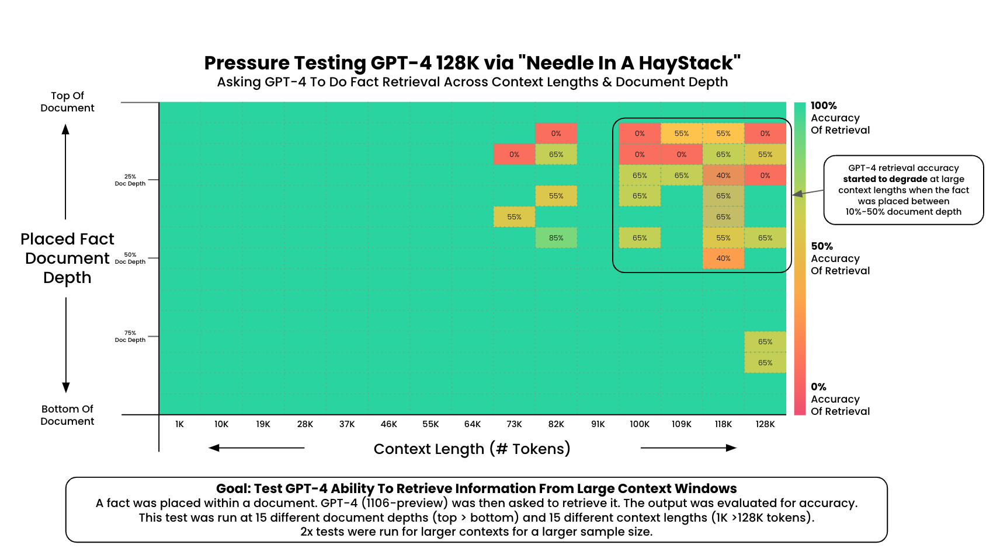

There's been a lot of hype around LLMs and the coming of AGI. So much so that it's easy to lose sight of what LLMs are good for or not.

LLMs excel at:

# Natural Language Interfaces

I know its an obvious place to start but yes, LLMs are great for things like chatbots, customer support, phone systems, etc. 
And there are some good reasons.

## Context Windows are Expanding

Context Windows are like the short-term memory of an AI model. They represent how much information the AI can "remember" and work with at one time. 

Imagine you're having a conversation with a friend. The context window is like how much of that conversation you can keep in your mind without forgetting earlier parts. A larger context window means the AI can handle longer, more complex conversations or tasks without losing track of important details.

For example, if you're using an AI to summarize a long article, a model with a small context window might only be able to work with a few paragraphs at a time. This could lead to a disjointed summary. On the other hand, a model with a large context window could potentially read and understand the entire article at once, producing a more coherent and comprehensive summary.

Here's a list of some of the notable LLM's available today and their context window lengths:

| Model | Context Window |
|-------|----------------|
| Gemini 1.5 Flash | 1,000,000 |
| Claude 3 Opus | 200,000 |
| Claude 3 Sonnet | 200,000 |
| Claude 3 Haiku | 200,000 |
| Claude 3.5 Sonnet | 200,000 |
| GPT-4 Turbo | 128,000 |
| Gemini 1.5 Pro | 128,000 |
| GPT4o | 128,000 |
| GPT-4o mini | 128,000 |
| GPT-4-32k | 32,000 |
| Gemini Pro | 32,000 |
| Mistral Medium | 32,000 |
| Mistral Large | 32,000 |
| GPT-3.5 Turbo | 16,000 |
| Mistral Small | 16,000 |
| GPT-4 | 8,000 |
| Llama 3 Models | 8,000 |
| GPT-3.5 Turbo Instruct | 4,000 |
| Nemotron | 4,000 |

A year ago, GPT-4 had a 128k context window so we've seen a 10x increase in context window size. Fundamentally, larger context windows allow natural language interfaces to immediately access more information.

## Find the Needle in the Haystack

LLMs are getting significantly better at finding data in a large context windows. Testing with GPT-4 found that you can reliably retrieve data in a 64k+ token prompt. Beyond 64k tokens, the retrieval performance degrades especially when searching for information at the beginning of the prompt.

64k tokens is the size of a short novel. You could fit the majority of the days news in a 64k token window. Fancy a chat with the day's news?

But GPT-4 isn't state of the art in this space. Google Gemini 1.5 Pro has a 1M token context window. For comparison, 1M tokens is the size of the entire Harry Potter series. You could generate the next book in the series following canon, Harry Potter and the Midlife Crisis.

## Voice App Infrastructure has Arrived

There's now a suite of tools available for building voice apps. First, there's voice-to-text API's to convert spoken words into text. Then there's the LLMs that can use their memory to understand the user's intent and generate a response. Lastly, there's text-to-speech API's to convert the text response back into emotive spoken words. 

### Voice-to-Text & Vica Versa Services

- Deepgram
- OpenAI
- ElevenLabs
- Cartesia
- Hume.AI

### Voice Infrastructure

To build low latency voice apps, you need to use a WebRTC serving infrastructure. Until recently, most WebRTC platforms were built for live stream broadcasting. A significantly different use case, a unidirectional one to many broadcast for high quality media.

WebRTC Providers for Voice Apps:

- LiveKit
- Stream
- Agora

# Structured Data from Unstructured Sources

In traditional computation, its difficult to extract structured data from sources such as:
- Websites
- PDFs
- Images
- Videos

Expensive and brittle data pipelines have been built for decades to attempt the task. LLMs have effectively solved the task at a development speed unrivaled by prior methods.

The implications of this are profound. Previously unsearchable data sources are now searchable. An image becomes queryable like a database. An HTML website practically becomes a public API. When building a product, its important to consider the public and private data sources that haven't been exploited yet by the LLM revolution.

# Cognitive Programming

Dynamic programming used to be driven by pre-defined rules and data structures. LLMs are enabling a new generation of cognitive programming where the program doesn't have pre-defined structures, the LLM generates on the fly. For example, a cognitive program 

